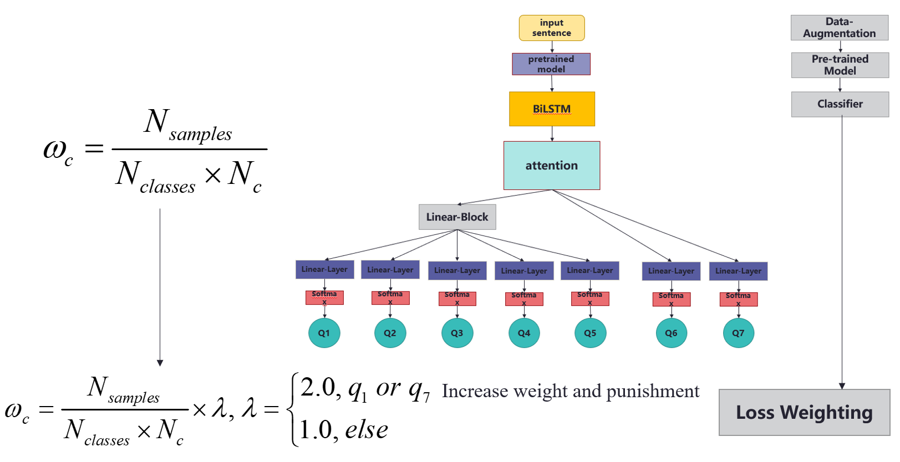
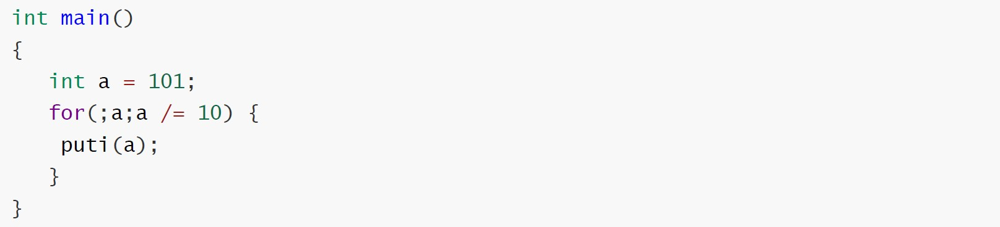
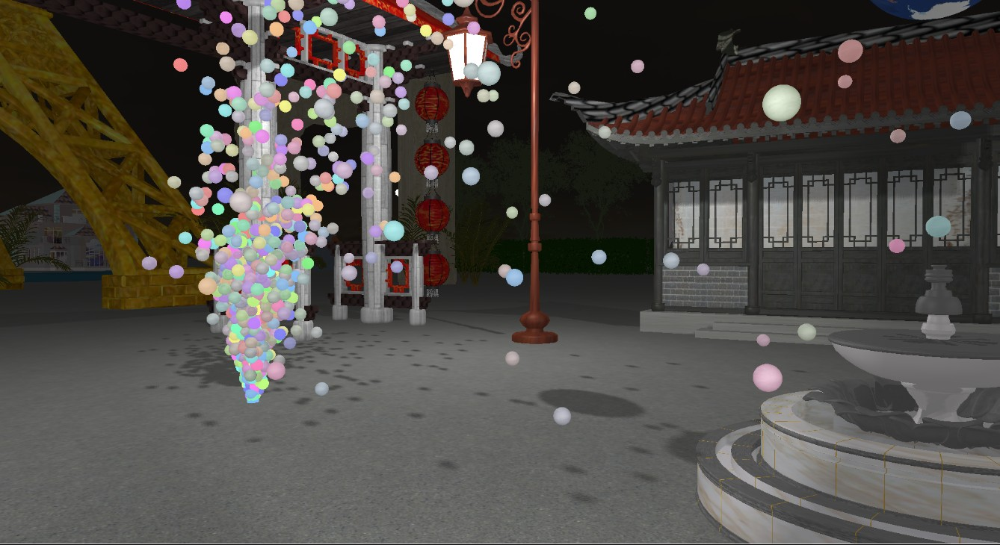
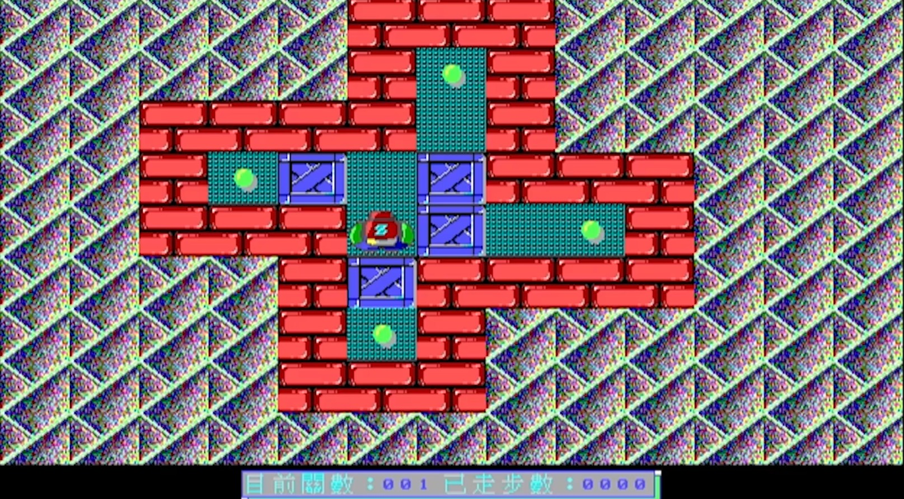
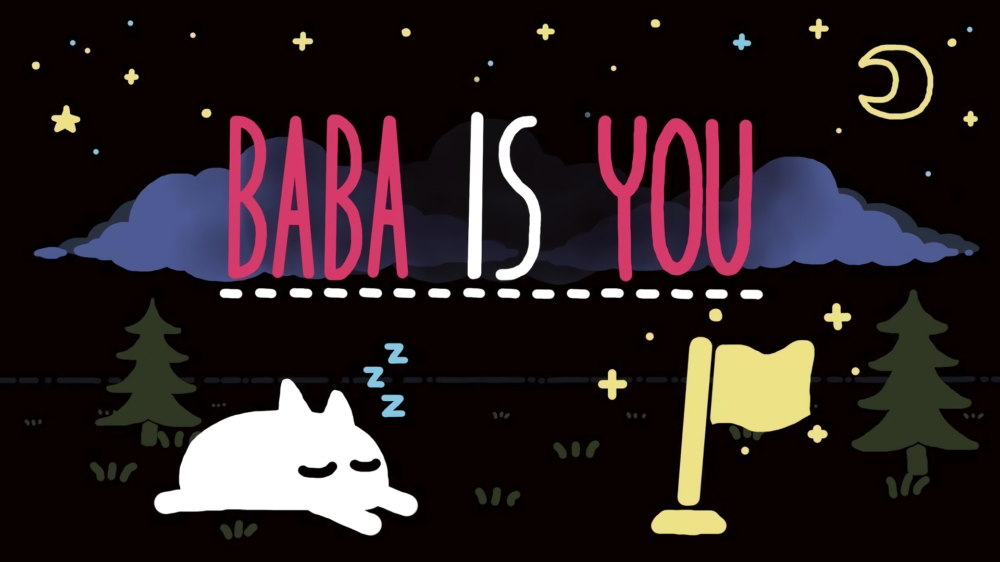


  You can also find my articles on <u><a href="{{author.googlescholar}}">my Google Scholar profile</a>.</u>


💻 I'm posting some of my recent Projects here.

------

###### 2022 

------

**[VQA Training Based on MindSpore](https://github.com/HoffYoung/nlp-project-vqa)** 

📝 **Published**: June 28, 2022

Visual Question Answering models implemented in `MindSpore`. We re-implemented the `baseline` model in paper [VQA: Visual Question Answering](https://arxiv.org/pdf/1505.00468.pdf), `stack attention` model in [Stacked Attention Networks for Image Question Answering](https://arxiv.org/pdf/1511.02274.pdf), and `top-down attention` model in [Tips and Tricks for Visual Question Answering: Learnings from the 2017 Challenge](https://openaccess.thecvf.com/content_cvpr_2018/papers/Teney_Tips_and_Tricks_CVPR_2018_paper.pdf), and made some improvements. It's our final group project for the course `Introduction to Natural Language Processing` at Zhejiang University.

**Question**: How many people are there in the picture?

**Answer**: '3'

------

**[Attribute Classification of COVID-19-Related Tweets Based on Natural Language Processing Models](https://github.com/haoyi-duan/nlp4if)**

📝 **Published**: May 24, 2022

**Student Research Training Program** based on [NLP4IF-Workshop--Shared-Task-On-Fighting the COVID-19 Infodemic](https://github.com/Veneziahhh/nlp4if/blob/main/nlp4if.md).

The primary task is to predict a series of `binary attributes` of COVID-19 Twitter from seven aspects. This is a multi-task problem, and there is a dependency between tasks. The dataset includes Twitter in `English`, `Bulgarian` and `Arabic`. 

------

**[CKC (CKCs-Kernel-Compiler)](https://github.com/haoyi-duan/CKCs-Kernel-Compiler)**

📝 **Published**: May 18, 2022

Based on C99, we have implemented a C language compiler, which can parse the C-like code input and output the target generation based on x86 assembly. The project is implemented with **Flex**, **Bison**, and **LLVM**.

------

###### 2021

------

**[“OpenCity” Game Project](https://github.com/haoyi-duan/Open_City)**

📝 **Published**: December 29, 2021

A group project in Computer Graphics course.

- Inspired by the game “SimCity”
- Rendered images within the OpenGL framework
- patent no.: 2022SR0805651, 2021, **Copyright Protection Center of China**

------

**[Sokoban Game Software Programmed in x86](https://github.com/haoyi-duan/Sokoban-Game)**

📝 **Published**: July 1, 2021

Sokoban Game Software Programmed in `x86`, running on `x86` architecture systems only (eg. Windows XP)

------

###### 2020

------

**["Baba is You" Game](https://github.com/haoyi-duan/Baba-is-You)**

📝 **Published**: January 19, 2020

Programmed the replica game "Baba is You" on FPGA based on Verilog.

------

