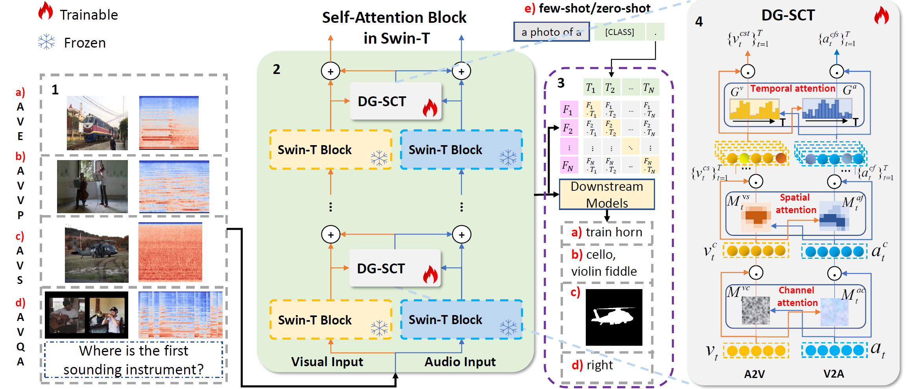


  You can also find my articles on <u><a href="{{author.googlescholar}}">my Google Scholar profile</a>.</u>


📘 I'm posting some of my recent Publications & Manuscripts here.

###### 2023

------

**Cross-modal Prompts: Adapting Large Pre-trained Models for Audio-Visual Downstream Tasks**

**Haoyi Duan**, Yan Xia, Mingze Zhou, Li Tang, Jieming Zhu, Zhou Zhao

*NeurIPS*’2023 (Under Review)

We proposed a novel Dual-Guided Spatial-Channel-Temporal attention (DG-SCT) mechanism, which leverages audio and visual modalities as soft prompts to dynamically adjust the parameters of pre-trained models based on the current multi-modal input features. our proposed method achieved state-of-the-art results across multiple downstream tasks, including AVE, AVS, AVVP, and AVQA; Also, our model exhibited promising performance in challenging few-shot and zero-shot scenarios.

###### 2022

------

**Time as Prompt for A Geography-aware Next Location Recommendation Framework** 

[[Paper]](https://arxiv.org/abs/2304.04151) [[Code]](https://github.com/haoyi-duan/TPG)

Yan Luo*, **Haoyi Duan***, Ye Liu, CHUNG Fu-Lai

*CIKM*'2023

We proposed a Temporal Prompt-based and Geography-aware (**TPG**) framework which has the unique ability of interval prediction. 

------

**Beyond Two-Tower Matching: Learning Sparse Retrievable Interaction Models for Recommendation**

[[Paper]](https://dl.acm.org/doi/pdf/10.1145/3539618.3591643)

Liangcai Su, Fan Yan, Jieming Zhu, Xi Xiao, ***Haoyi Duan***, Zhou Zhao, Zhenhua Dong, Ruiming Tang

*SIGIR*'2023

Our team propose the first matching framework **SparCode** that supports both arbitrary forms of all-to-all interaction models and sparse inverted indexing. We design a code-based sparse inverted indexing based on Product Quantization and sparse scoring to ensure efficient inference, and employed all-to-all interaction models to improve retrieval accuracy. 

------

