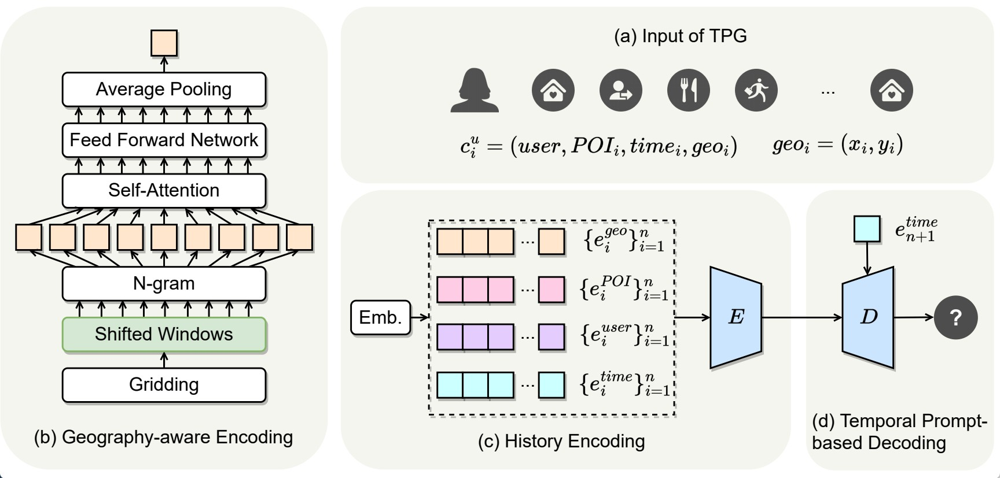
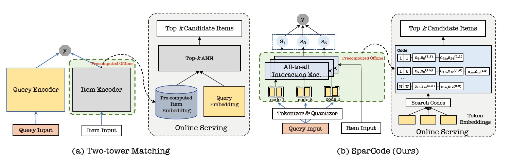


  You can also find my articles on <u><a href="{{author.googlescholar}}">my Google Scholar profile</a>.</u>


📘 I'm posting some of my recent Publications & Manuscripts here.

###### 2022

------

**[Time as Prompt for A Geography-aware Next Location Recommendation Framework](https://github.com/haoyi-duan/TPG)** 

Yan Luo*, **Haoyi Duan***, Ye Liu, CHUNG Fu-Lai

*WWW*'2023 Under Review

We proposed a Temporal Prompt-based and Geography-aware (**TPG**) framework which has the unique ability of interval prediction. 

------

[**Beyond Two-Tower Matching: Learning Sparse Retrievable Interaction Models for Recommendation**](https://github.com/haoyi-duan/SparCode)

Liangcai Su*, **Haoyi Duan***, Jieming Zhu, Fan Yan, Xi Xiao, Zhou Zhao, Zhenhua Dong, Ruiming Tang

*WWW*'2023 Under Review

Our team propose the first matching framework **SparCode** that supports both arbitrary forms of all-to-all interaction models and sparse inverted indexing. We design a code-based sparse inverted indexing based on Product Quantization and sparse scoring to ensure efficient inference, and employed all-to-all interaction models to improve retrieval accuracy. 

------

